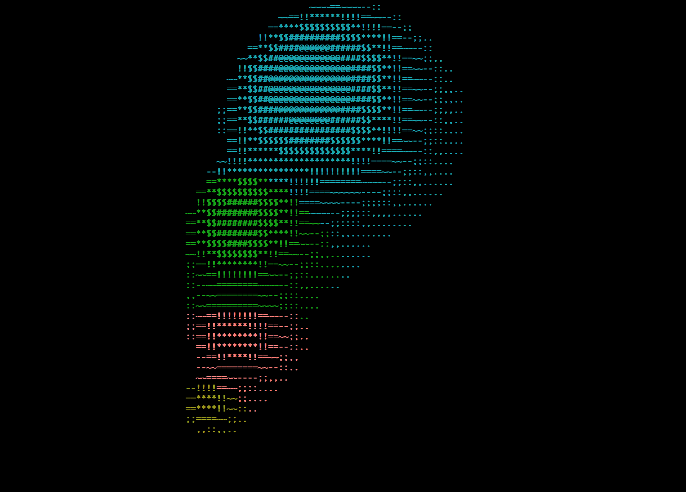

# ASCII Metaball Raymarcher

Quick-and-dirty test proof-of-concept for 3D metaball raymarching.
Renders several test metaballs in motion to the terminal in ASCII (because other rendering options were not immediately available)



## Installation

Requires NCURSES.
Compile with any C compiler; something like:
```
cc -lm -lncurses ASCIIMetaballRayTrace.c
```

## Usage

Running the resulting executable will render several floating, orbiting metaballs to the terminal.
Press space to pause the movement.
